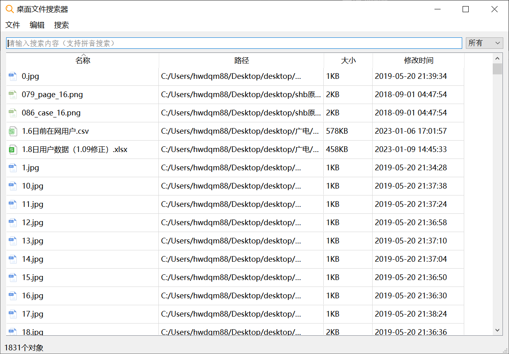
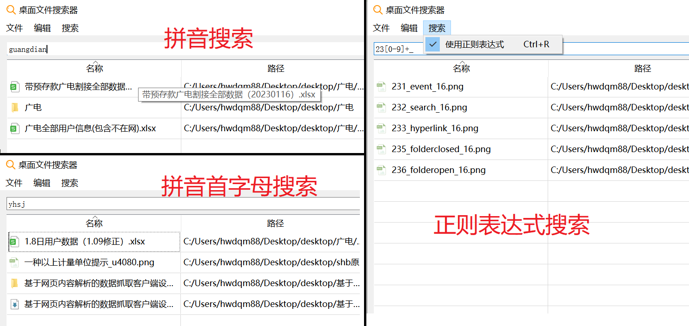
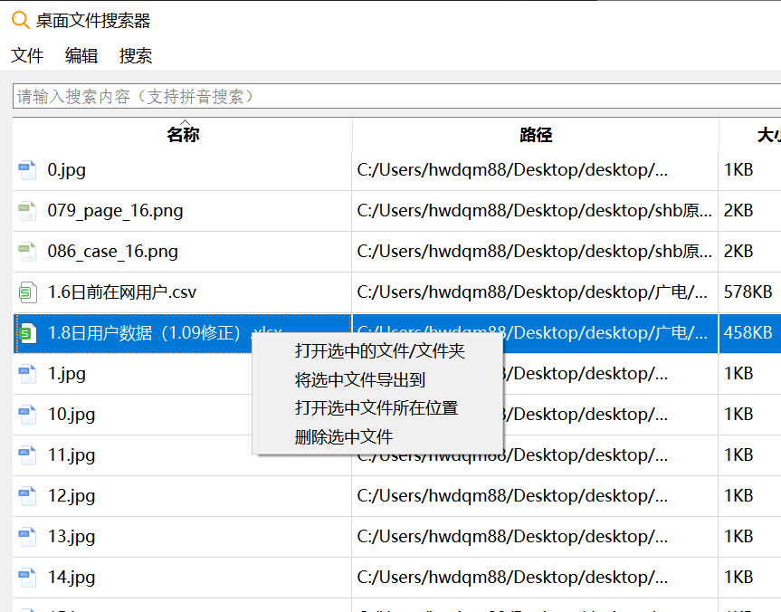
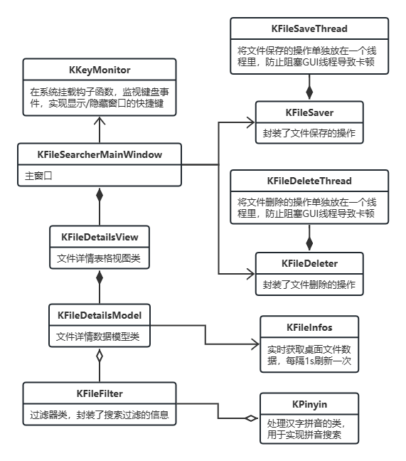

## 桌面文件搜索工具说明

本项目是Qt的练习，界面UI参考了Everything。

### 一、程序功能说明

#### 1. 启动说明：
启动程序之后程序启动后默认隐藏，弹出对话框提示用户，通过 alt+空格 唤出，再次按下 alt+空格 隐藏。

#### 2. 唤出后主界面如下图所示：

#### 3. 实现的功能：

+ 实时解析桌面全部的文件和文件夹（递归解析文件夹下的文件），将全部的文件/文件夹信息显示出来，显示内容会随着桌面文件的变化更新。
+ 文件信息过长可能显示不全，鼠标在上面悬浮可以以提示的形式全部显示。
+ 文件默认按照名称升序排序，可以通过点击表头，按照名称/路径/大小/修改时间进行排序，再次点击切换升序和降序。
+ 在输入框输入内容可以进行搜索，支持拼音搜索、首字母搜索和模糊匹配。比如输入"guangdian"可以搜索出"xx广电xx"，输入"yhsj"可以搜索出"xx用户数据xx"，输入"wps"可以搜索出"windowspowershell.exe"。
+ 支持正则表达式搜索，点击 搜索-正则表达式 打开或关闭，或者按 Ctrl+R 快捷键打开或关闭。搜索示例如图：

+ 右上角的下拉列表可以筛选文件或文件夹。
+ 选中文件（按住Ctrl可以选择多个文件）后单击右键可以打开右键菜单，右键菜单中实现了打开文件、导出文件、打开文件所在位置、删除文件的功能。右键菜单如图：

+ 最上面的标题栏还实现了导出、全选、删除等功能，具都是字面意思，这里不再赘述。
+ 左下角状态栏显示当前搜索到的文件/文件夹数量。

### 二、代码说明

#### 1. 类关系UML图：

#### 2. 引用说明：

引用了GitHub用户newMoonxx的ChineseToPinyin仓库，此仓库实现了汉字转化为拼音的代码，以便于实现拼音搜索。

链接：https://github.com/newMoonxx/ChineseToPinyin

在我的项目中的kpinyin.h、kpinyin.cpp两个文件是引用的代码。

#### 3. 代码值得注意的feature：

+ 文件详情的表格部分采用了Qt的MVD模式，自定义了Model类和View类（Delegate类不太需要就没用）。
+ 桌面的文件信息缓存在KFileInfos类中，并且开启定时器每1s更新一次文件信息，如果发现文件有变化则发送信号更新文件详情的显示内容。KFileInfos采用单例模式。
+ 保存和删除文件的操作封装在了单独的线程里面，这是因为有的时候选中的文件太多，保存和删除会很慢，会阻塞GUI线程，导致界面卡死。封装到单独的线程后不会影响GUI的显示。
+ 由于Qt的界面隐藏失去聚焦之后无法捕获键盘事件，所以单独实现了KKeyMonitor类，自定义钩子函数调用Windows系统的API，用于监视键盘事件。这样就可以实现用 Alt+空格 的快捷键隐藏或显示界面了。KKeyMonitor也采用了单例模式。
